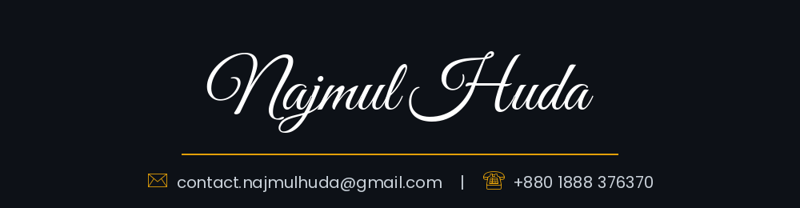
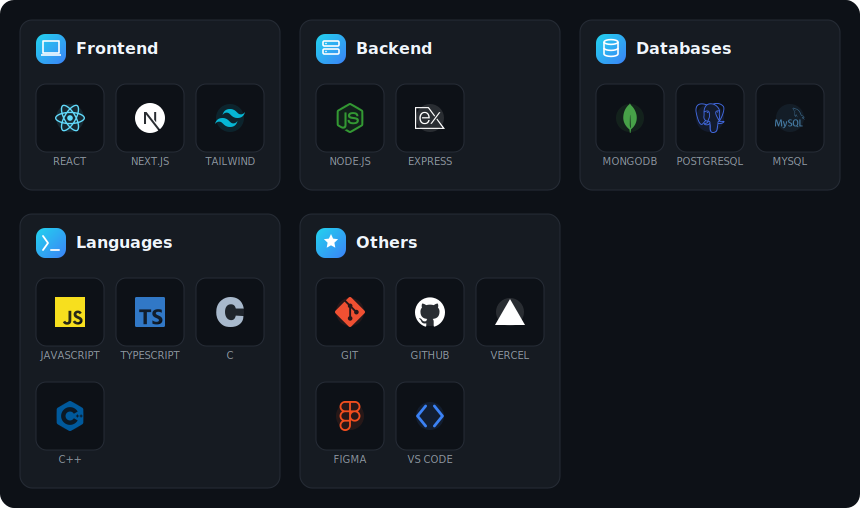
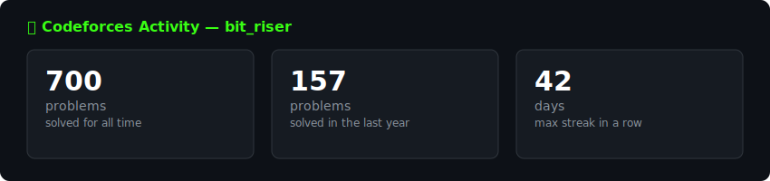

  
  
  
  

<h1 align="center">About Me</h1>

<b>Building the Web | Solving the Algorithms</b>    <b>CSE undergrad (3rd year)</b> & <b>Competitive Programmer</b> with <b>700+ problems solved</b> on Codeforces, CodeChef, LeetCode & more. Participated in <b>ICPC Dhaka Regional Contest-2025 (Onsite)</b> and <b>2x IUPC</b>. Learning the <b>MERN stack</b> — completed <b>Programming Hero Level-01</b> with <b>SCIC reward</b> for on-time assignment submissions.

 

  

<h1 align="center">Skills & Tech </h1>

  

<h1 align="center">Projects</h1>

<code>📅 July 2026</code>

<h3 align="center">Learning Management System (LMS)</h3>

  
  
  
  

  
  

 

  <code>📅 Jun 2026</code>

<h3 align="center">Aura Canvas – Online Art Marketplace</h3>

  
  
  
  
  
  
  

  
  

  <code>📅 May-Jun 2026</code>

<h3 align="center">MediQueue - Advanced Tutor & Medical Learning Management Platform</h3>

  
  
  
  
  
  
  

  
  

 

<code>📅 May 2026</code>

<h3 align="center">GitHub Issues Tracker</h3>

  
  
  

  
  

 

**🆔 ICPC ID:** [E20K3SWR4FXW](https://icpc.global/ICPCID/E20K3SWR4FXW)

 

[portfolio](https://najmul-huda.vercel.app/) ✉ contact.najmulhuda@gmail.com &nbsp;|&nbsp; ☎ +880 1888 376370

